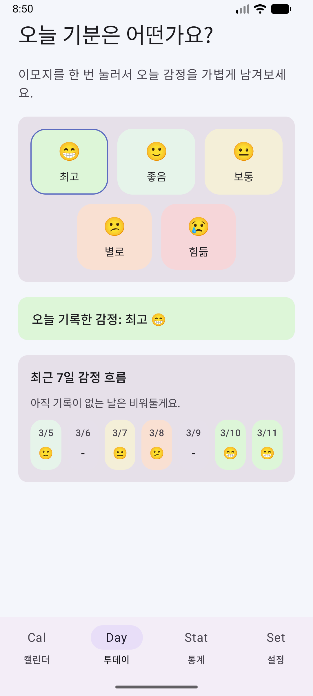
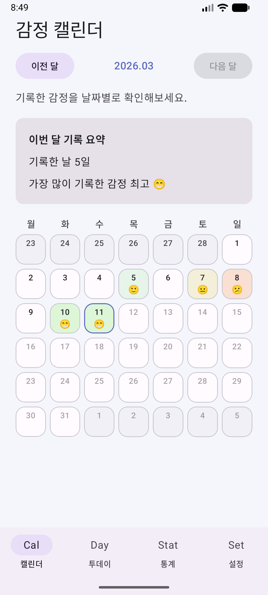
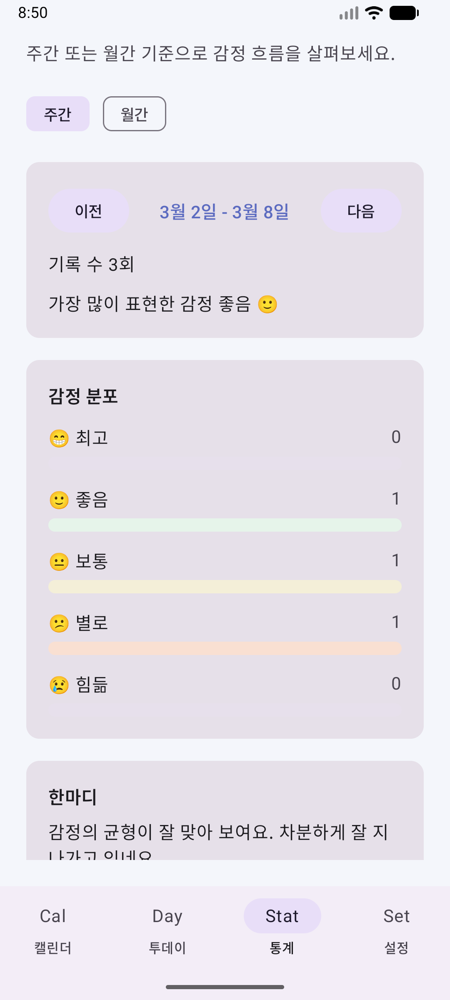
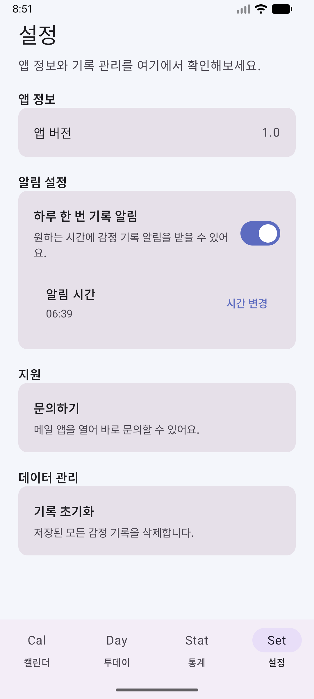

# Moodiary

가볍게 감정을 기록하고, 캘린더와 통계로 흐름을 돌아볼 수 있는 Android 무드 트래킹 앱입니다.

## Overview

Moodiary는 하루의 기분을 빠르게 기록하고, 최근 기록과 월간 캘린더, 주간/월간 통계를 통해 감정 흐름을 확인할 수 있도록 만든 개인 프로젝트입니다.

기록 과정은 최대한 단순하게 유지하고, 이후에 돌아보는 경험은 직관적으로 보이도록 구성했습니다.

## Features

- 오늘의 감정을 5단계 무드 칩으로 빠르게 기록
- 최근 7일 감정 요약 확인
- 월간 캘린더에서 날짜별 감정 확인 및 수정
- 주간/월간 통계 조회
- 감정 분포와 가장 자주 기록한 감정 확인
- 통계 결과에 따라 응원 메시지 표시
- 알림 시간 설정 및 일일 리마인더 알림
- 앱 버전 확인, 문의 메일 연결, 전체 기록 초기화

## Screenshots

| Today | Calendar |
|---|---|
|  |  |

| Statistics | Settings |
|---|---|
|  |  |

## Demo Video

- Short demo: [Watch on YouTube](https://youtube.com/shorts/erwWZIpn2wE?feature=share)

## Screens

- `Today`
  - 오늘의 감정을 선택하고 최근 7일 기록을 확인하는 메인 화면
  - `LazyColumn` 기반으로 스크롤 가능한 구조
- `Calendar`
  - 월 단위 감정 기록을 확인하고 특정 날짜 감정을 수정하는 화면
- `Statistics`
  - 주간/월간 기준 감정 통계와 메시지를 보여주는 화면
- `Settings`
  - 알림 시간 설정, 문의, 데이터 초기화 등을 제공하는 화면

## Tech Stack

- Kotlin
- Jetpack Compose
- Material 3
- MVVM
- Hilt
- Room
- Coroutines
- Multi-module Android project

## Architecture

프로젝트는 기능과 역할에 따라 모듈을 분리한 구조로 구성했습니다.

- `app`
  - 앱 진입점, DI 설정, 탭 구성
- `domain:mood`
  - 엔티티, 리포지토리 인터페이스, 유즈케이스
- `data:mood`
  - Room DB, DAO, Repository 구현
- `feature:home`
  - 오늘 감정 기록 화면
- `feature:calendar`
  - 캘린더 화면
- `feature:statistics`
  - 통계 화면
- `feature:settings`
  - 설정 및 리마인더 화면
- `core:designsystem`
  - 공통 테마 및 UI 컴포넌트

## Key Implementation Points

- 감정 기록은 `Room`에 로컬 저장되며 네트워크 연결 없이 동작합니다.
- `Hilt`로 DB, Repository, UseCase를 주입해 화면과 데이터 계층을 분리했습니다.
- `Today`, `Calendar`, `Statistics`, `Settings` 화면을 기능 모듈로 나눠 유지보수성을 높였습니다.
- 통계 화면은 기간 이동과 주간/월간 전환을 지원합니다.
- 설정 화면에서는 알림 권한 처리와 리마인더 시간을 함께 관리합니다.
- 리마인더는 `AlarmManager`와 `NotificationChannel`을 사용해 구현했습니다.

## Project Structure

```text
Moodiary/
+- app/
+- core/
|  \- designsystem/
+- data/
|  \- mood/
+- domain/
|  \- mood/
+- docs/
|  \- screenshots/
+- feature/
|  +- home/
|  +- calendar/
|  +- statistics/
|  \- settings/
+- gradle/
\- README.md
```

## Download

- APK: [Download v1.0.0](https://github.com/sanghyuk0612/Moodiary/releases/tag/v1.0.0)
- Releases: [View all releases](https://github.com/sanghyuk0612/Moodiary/releases)

## Getting Started

### Requirements

- Android Studio
- JDK 17
- Android SDK

### Build

```bash
./gradlew assembleDebug
```

### APK Location

- Debug APK: `app/build/outputs/apk/debug/app-debug.apk`
- Release APK: `app/build/outputs/apk/release/app-release.apk`

또는 Android Studio에서 `Build > Build APK(s)`를 실행한 뒤 생성된 APK를 바로 확인할 수 있습니다.

## What I Focused On

- 기록 흐름을 짧고 가볍게 만드는 UX
- 감정 데이터를 캘린더와 통계로 자연스럽게 이어주는 구조
- Compose 기반 UI를 기능 단위로 분리하는 모듈 설계
- 포트폴리오에서도 설명 가능한 구조와 책임 분리

## Future Improvements

- 감정 메모 기능 추가
- 백업 및 복원 기능
- 위젯 또는 홈 화면 숏컷 지원
- 통계 시각화 고도화
- 다크 모드 및 디자인 개선
- Google Play 출시 및 사용자 피드백 반영

## Portfolio Note

이 프로젝트는 단순한 감정 기록 앱을 넘어서,

- Compose UI 설계
- 로컬 데이터 저장
- DI 적용
- 기능 모듈 분리
- 알림 기능 구현

까지 직접 설계하고 구현한 Android 포트폴리오 프로젝트입니다.
